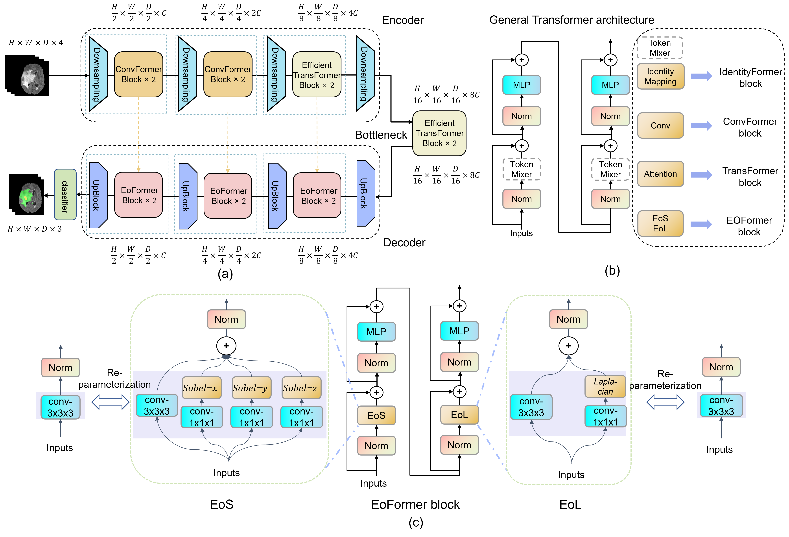
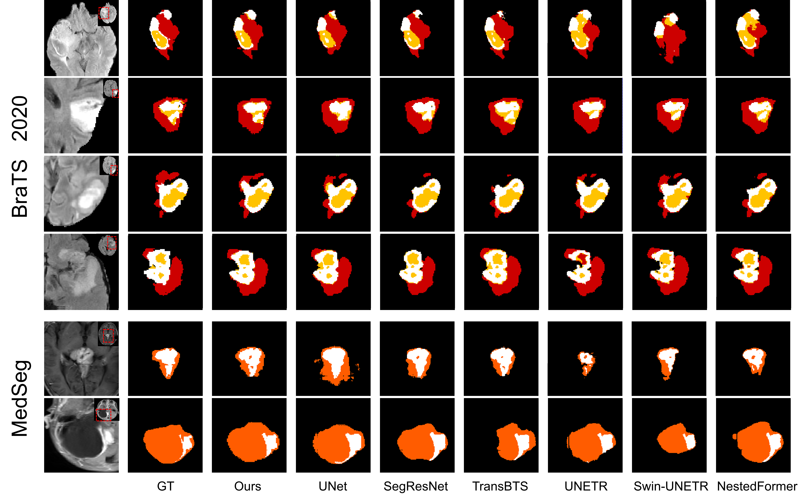

# EoFormer
Official PyTorch Implementation of EoFormer

> EoFormer: Edge-oriented Transformer for Brain Tumor Segmentation [paper](https://link.springer.com/chapter/10.1007/978-3-031-43901-8_32)




## Enviroments
1. Clone the repository

`git clone https://github.com/sd0809/EoFormer.git`

2. Create a conda environment and install the required packages

```
conda create -n EoFormer python==3.8
conda activate EoFormer
pip install -r requirements.txt
```

## Data
Put the BraTS 2020 dataset in `data_path`

You can download BraTS 2020 dataset in [here](https://www.med.upenn.edu/cbica/brats2020/data.html)

```
BraTS2020
| -- BraTS2020_TrainingData
| -- BraTS2020_ValidationData
```

## Train & Test
`python main.py --data_path <data path> --args ……` or `sh run.sh`
## Citation
```
@inproceedings{she2023eoformer,
  title={EoFormer: Edge-Oriented Transformer for Brain Tumor Segmentation},
  author={She, Dong and Zhang, Yueyi and Zhang, Zheyu and Li, Hebei and Yan, Zihan and Sun, Xiaoyan},
  booktitle={International Conference on Medical Image Computing and Computer-Assisted Intervention},
  pages={333--343},
  year={2023},
  organization={Springer}
}
```

## 
If you find our project useful, please consider starring it  : )